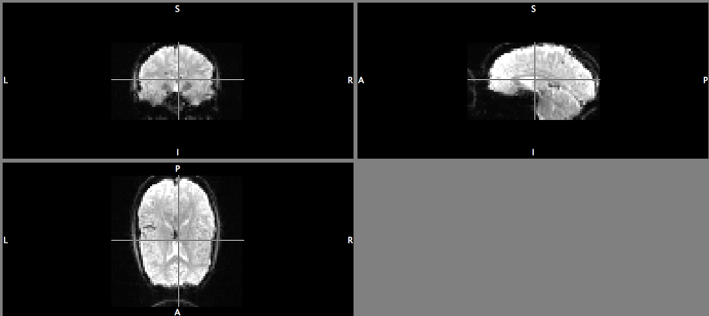
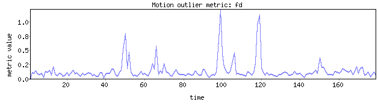

# Case Study in the Analysis of fMRI Data

## Goal

In this project, we address a research question that is answered by using **task-based fMRI**.

You will all work with a different subset of the same data set.

Our goal is two-fold:
1. Going through the full pipeline of an fMRI data analysis
2. Study the impact of changing a particular option in the pipeline on the final results.
In particular, variations are possible in:
  * Smoothing (*preprocessing*)
  * HRF (*preprocessing*)
  * Combining runs within subjects (*analysis*)
  * Combining subjects in a group analysis (*analysis*)
  * Thresholding (*inference*)
  * Cluster connectivity (*inference*)
  * Sample size
  * ...

  The paper of Pauli et al. (2016) in which this is studied for a number of software packages including FSL can be found [here](https://www.frontiersin.org/articles/10.3389/fninf.2016.00024/full).

  We will decide who will study which variation in a later stage.


You will need to hand in a paper of **maximum 5 pages**
witn one page introduction to describe the research question and dataset, the methods section and the results section.

During the project, you will need to think about data management and scripting your analyses to enable reproducing your results.

You can communicate with other students of your group to discuss results and compare them. You will all consider a different subset so it is interesting to see how results compare. Further, code can be shared throught the [GitHub platform of UGent](https://github.ugent.be). We won’t judge intermediate versions of the code, on the other hand it can be of great help for everyone during the course of the project.


## Data

We use a data set that is publicly available on [openfMRI](https://openfmri.org).

We will focus on the analysis of the imaging data of the **False belief task** in the paper of Moran, Jolly and Mitchell (2012, [Social-Cognitive Deficits in Normal Aging](http://www.jneurosci.org/content/32/16/5553)).

The link to the data can be found [here](https://openneuro.org/datasets/ds000109/versions/0001).


In total, we will use the data of **33 subjects**. On a total of 48 subjects, for 12 subjects there are no imaging data available and for 3 subjects, there are only data available for 1 run (see further). These 15 subjects with missing or partial imaging data will not be included in the analysis.

We will proceed as follows:
* Each of you will perform a data analysis on a random subset of 12 subjects (5 old and 7 young).
* One of you will study the impact of increasing sample size by analysing the full data set of 30 subjects in addition to the original analysis based on 12 subjects.
* We will perform some pre-processing steps prior to the actual modelling phase. The student who will study the impact of sample size, can request some preprocessed data of subjects that were not part of the original analysis from other students. This means that in addition to script management, you will all have to think about data management and data file information to enable efficient data sharing.

The random subsets are as follows:
* **Set 1**  
  * *young*: `sub-43` `sub-48` `sub-22` `sub-21` `sub-01` `sub-03` `sub-27`  
  * *old*: `sub-19` `sub-25` `sub-34` `sub-38` `sub-07`
* **Set 2**  
  * *young*: `sub-43` `sub-03` `sub-28` `sub-15` `sub-17` `sub-31` `sub-08`  
  * *old*:
`sub-19` `sub-38` `sub-34` `sub-07` `sub-36`
* **Set 3**  
  * *young*:  `sub-22` `sub-03` `sub-11` `sub-18` `sub-31` `sub-15` `sub-14`  
  * *old*: `sub-07` `sub-39` `sub-25` `sub-19` `sub-29`
* **Set 4**  
    * *young*:  `sub-09` `sub-27` `sub-31` `sub-32` `sub-02` `sub-21` `sub-08`  
    * *old*: `sub-36` `sub-05` `sub-19` `sub-39` `sub-34`
* **Set 5**  
    * *young*:  `sub-27` `sub-18` `sub-48` `sub-31` `sub-02` `sub-08` `sub-14`  
    * *old*: `sub-19` `sub-36` `sub-39` `sub-47` `sub-05`
* **Set 6**  
    * *young*:  `sub-48` `sub-43` `sub-26` `sub-17` `sub-01` `sub-18` `sub-22`
    * *old*: `sub-36` `sub-42` `sub-19` `sub-25` `sub-34`


## Data structure

FSL uses files in nifti format; these files have extension ```.nii``` or ```.nii.gz```. The files with the latter extension are in fact gzipped nifti files (smaller in size). You can easily convert between both.

zip:
>data.nii -> data.nii.gz
```bash
gzip data.nii
```

unzip:

>data.nii.gz -> data.nii
```bash
gunzip data.nii.gz
```

The data are organised in the following folders:
* sub-01
  * anat: ```sub-01_T1w.nii.gz```  
  the high resolution anatomical image of subject 1
  * func:  
  an experiment is often split up in several short runs or uninterrupted periods of scanning that are statistically combined together into one experiment
    * for run 1
      * ```sub-01_task-theoryofmindwithmanualresponse_run-01_bold.nii.gz```  
      the images or scans
      * ```sub-01_task-theoryofmindwithmanualresponse_run-01_events.tsv```  
      a file that contains the timing of the trials
    * for run 2
      * ```sub-01_task-theoryofmindwithmanualresponse_run-02_bold.nii.gz```  
      * ```sub-01_task-theoryofmindwithmanualresponse_run-02_events.tsv```  
* sub-02
* ...

In addition, there is a file `participants.tsv` which contains the gender and age of each subject. Please check whether the individuals in your subset are divided correctly (*young* for age &lt; 50 - *old* for age &gt; 50).


## Software

We use [FSL](https://fsl.fmrib.ox.ac.uk/fsl/fslwiki/) to analyse the data.

FSL can be installed on Linux and Mac Os X. For Windows, a virtual box needs to be installed (see [FSL wiki](https://fsl.fmrib.ox.ac.uk/fsl/fslwiki/) for more details).

In general, to run the FSL tools/functions from the command line (within a terminal - for Windows, this will be on the terminal within the virtual machine) you need to enter the program name in lower case (e.g. bet). Typing a command on its own (without any arguments or options) gives you a help message for that command.

The main FSL GUI can be run by just typing ```fsl```.

We will focus on scripting because
* this allows to automate or batch processes such as routines over runs, subjects etc. which is of course way more efficient.
* you will have all the functions and commands you frequently use in a file.
* you can easily share your analysis pipeline.
* it helps you to understand other people's scripts/tools
* it enables reproducibility!!
* ...

We will use Shell scripts (```bash```) because it is relatively simple and is portable. It is just like the command line within a terminal (Linux and Mac Os X). However, there are other possibilities such as Python.

## Help: information and examples

There are many tutorials and examples available on the use of FSL to analyse fMRI data.

* [Online FSL course materials](http://fsl.fmrib.ox.ac.uk/fslcourse/), also on [shell scripting](http://fsl.fmrib.ox.ac.uk/fslcourse/lectures/scripting/index.htm)
* [FSL wiki](https://fsl.fmrib.ox.ac.uk/fsl/fslwiki/)
* A very good source of information on the FSL pipeline for analysing task-fMRI: YouTube channel [Mumford Brain Stats](https://www.youtube.com/channel/UCZ7gF0zm35FwrFpDND6DWeA/videos) by Jeanette Mumford (University of Wisconsin). We will mainly follow the approach taken there.
* ...

## Data analyis

### Basic workflow for analysing task-fMRI

In an fMRI study, MRI scans of the brain are repeatedly taken. This allows to compare scans of the brain between different conditions (e.g. looking at houses versus looking at faces) to infer which brain regions are activated during a specific task.

We will see that in reality, the analysis of fMRI data is quite complex and entails more then simply comparing images over conditions. There exist many different pipelines and variations for analysing fMRI data.  

We will follow the workflow below.

1. Inspect (nifti) files and data folders
2. Skull strip structural images
3. Run some basic preprocessing on functional data (motion assessment).
Further preprocessing happens in first level analyses.
4. Run level 1 analyses: analyse data of a single run (for each individual)
5. Run level 2 analyses: for each subject, combine results over different runs
6. Run group level model: combine results over individuals

Feel free to explore the different options of the functions as we will use them or to explore different pipelines but do not forget to keep your analyses documented at all times!

If time allows, we will also look at **power and sample size calculations** for future studies based on the data at hand.


### Step 1: let's get started by looking at the data files

Looking at (raw) data is an important step to assess the quality of the files and data structure.

By scrolling through the data folders, we learn that the experiment exists of 2 runs for each subject and there are 4 different conditions.

First, we need to make sure that we have the onset file for each condition in each run for each subject. Here, we need 4 onset files per run. In these text files, it is indicated at what time a stimulus is presented and what the duration of the trial was.

I have provided a folder with the different onset files. These onset files were created from the tsv-file with events for each subject. We can have a look at the content of this file of **run 1** of **subject 1** using the unix command ```more```(*make sure the path to your folder is correct - the command below starts from the location in which the data folder **ds000109_R2.0.2** is located*):

```bash
more ds000109_R2.0.2/sub-01/func/sub-01_task-theoryofmindwithmanualresponse_run-01_events.tsv
```

Type q to exit.

The 4 different conditions are:

```
condition 1 = false belief story
condition 2 = false belief question
condition 3 = false photo story
condition 4 = false photo question
```

The corresponding onset file for condition 1 (*false belief story*) is as follows:

```
 10.000000	10	1
 70.000000	10	1
 96.000000	10	1
124.000000	10	1
184.000000	10	1
270.000000	10	1
```

The first stimulus is presented at 10 seconds and the trial last 10 seconds etc. The third column is a column for *parametric modulation*. If a stimulus is not simply on or off but can happen at a variety of levels during the experiment, then a parametric modulator can be added in the model. Here, this is not the case and hence, the third columns exist of all 1's.

We need to check whether we have 2 tsv-files (one for each run) for each subject in the data set. We can do this in a simple way using the following command:

```bash
ls ds000109_R2.0.2/sub-[0-4][0-9]/func/sub-[0-4][0-9]_task-theoryofmindwithmanualresponse_run-0[1-2]_events.tsv | more
```
This will render a list of existing files by going through the numbered files (*indices between brackets are sequentially filled out in the expression, e.g. we first look at run-01 and then run-02; same for subject index*). By using the option *more* at the end of the command, only one page at a time is displayed. You can press space bar to go to the next page. Type q to exit in the end.

We find that for **subject 23**, **subject 46** and **subject 49**, there is only data for 1 run. It is unclear why this is the case so we will exclude these subjects from further analyses.

In the same way, we can check the available BOLD data (*functional data*) for each individual.

```shell
ls ds000109_R2.0.2/sub-[0-4][0-9]/func/sub-[0-4][0-9]_task-theoryofmindwithmanualresponse_run-0[1-2]_bold.nii.gz | more
```

Second, information on functional scans can be obtained using ```fslinfo``` and ```fslhd``` (look at header of file).
```bash
fslhd ds000109_R2.0.2/sub-01/func/sub-01_task-theoryofmindwithmanualresponse_run-01_bold.nii.gz
```
```bash
fslinfo ds000109_R2.0.2/sub-01/func/sub-01_task-theoryofmindwithmanualresponse_run-01_bold.nii.gz
```
We can do this in the same way for the structural scans:
```bash
fslinfo ds000109_R2.0.2/sub-01/anat/sub-01_T1w.nii.gz
```
Using ```fslnvols```, we can obtain the number of volumes (*number of scans*) of a particular bold file.
```bash
fslnvols ds000109_R2.0.2/sub-01/func/sub-01_task-theoryofmindwithmanualresponse_run-01_bold.nii.gz
```
For run 1 of subject 1, we find there are 179 volumes.

The script ```checkvolumes.sh``` is written to automate this process and is provided on GitHub. The script generates a list with subjects, runs and number of volumes (number of scans). To run the script and write the output to a text file, use the following command:
```bash
bash checkvolumes.sh > outputvolumes.txt
```
In this text file, all information above can be found. In this way, we can see the data that are available. We further find that each run for each subject consists of 179 volumes / scans.

Third, we can check the orientation for the anatomical image (we will do this later for the functional images):
```bash
fslview ds000109_R2.0.2/sub-01/anat/sub-01_T1w.nii.gz
```
The following labels should be there: **L**eft, **R**ight, **A**nterior, **P**osterior, **S**uperior, **I**nferior. Also look at how the image is oriented. For the first subject, image orientation is presented in the usual way (have a look at it).


Note that the faces are missing in the images. Images are defaced for privacy reasons.

### Step 2: skull strip structural images

We will now extract the brain from the structural images. Having non-brain tissue (skull and eyes are typically very bright in an image) may cause problems for image registration (see further).

The primary tool we will use for this is the fsl function ```bet``` and then in a next step ```fslview``` for the assessment of the quality of the brain extraction (and yes, this quality assessment needs to be done for each subject manually).

The usage of ```bet``` is as follows
```
bet <input> <output> [options]
```

We will give our output file the same name as our input file but add the extension “_brain”.

Typing ```bet```in the command line renders the possible options.

In first instance, we will use these options:


Option | &nbsp;
------ | -----
-m | generates binary mask (brain: yes or no) // convenient for quality assessment of brain extraction
-R | robust brain centre estimation // The BET algorithm starts with sphere around the center. This sphere expands until a boundary is hits. This does not work well when the estimation of the center is not good; robust estimation of this center typically does a good job.
-g | vertical gradient in fractional intensity threshold (-1->1); default=0; positive values give larger brain outline at bottom, smaller at top

If these options are not sufficient to have a good quality of the brain extraction, explore some other options.

For subject 1, let's start with standard ```bet```.

```bash
bet ds000109_R2.0.2/sub-01/anat/sub-01_T1w.nii.gz ds000109_R2.0.2/sub-01/anat/sub-01_T1w_brain.nii.gz -m
```

The outcome can be assessed using ```fslview```
```bash
fslview ds000109_R2.0.2/sub-01/anat/sub-01_T1w.nii.gz
```
You can add the mask created by ```bet``` on top of this structural image (in the window of FSLview, use ```add file``` - the file with the mask is a nifti file with the same name as identified in the output file of ```bet``` but with extension '_mask'). Use the slider to adjust transparancy. This overlay enables to visually evaluate the quality of skull stripping.

The outcome is as follows:


Quite some non-brain tissue is retained (yellow represents the mask, hence the 'brain' that is extracted).

The command using robust center estimation and a small adjustment of the gradient renders a much better result.
```bash
bet ds000109_R2.0.2/sub-01/anat/sub-01_T1w.nii.gz ds000109_R2.0.2/sub-01/anat/sub-01_T1w_brain.nii.gz -R -g -0.05 -m
```


### Step 3: basic preprocessing on functional data

We will now perform some basic preprocessing on the functional data. It is important to point out that the approach taken here can vary. Further note that in this section, we will not cover all essential preprocessing steps. Some preprocessing procedures are run at the same time as the first level analyses.

Either in this phase or later, one should consider whether volumes of the functional data need to be **trimmed from the beginning**. That means that a relatively small number of the first scans will be left out. Due to the scanner warming up, the brightness in the first runs can be much higher. Data obtained from openfMRI should be fine in this respect. You can check this by opening a bold image in fslview. FSL will automatically open the first volume (FSL starts counting from 0). You can change between volumes by typing in the number of the volume you wish to access.
```bash
fslview ds000109_R2.0.2/sub-01/func/sub-01_task-theoryofmindwithmanualresponse_run-01_bold.nii.gz
```
For the first run of subject 1, we find no evidence of the first scans being more bright. You can check for the other run and subjects. We will not consider trimming the volumes.

However, we find that the **orientation** of the functional data image is reversed (left is right, anterior is posterior) as comapred to structural image (and hence standard template images). We will use ```fslreorient2std``` for this. First, we need to make sure that lables are correct. This seems fine here. To keep storage of these large files managable, we will overwrite the original image. Of course, if you do this on other data, first make sure that ```fslorient2std``` does everything correct and make sure you still have the original file somewhere. In our case here, the original data remain available as this is an open data set available on openfMRI.
```
Usage: fslreorient2std <input_image> [output_image]

fslreorient2std is a tool for reorienting the image to match the
approximate orientation of the standard template images (MNI152).
It only applies 0, 90, 180 or 270 degree rotations.
It is not a registration tool.
It requires NIfTI images with valid orientation information
in them (seen by valid labels in FSLView).  This tool
assumes the labels are correct - if not, fix that before using this.
If the output name is not specified the equivalent transformation
 matrix is written to the standard output
```
```bash
fslview ds000109_R2.0.2/sub-01/func/sub-01_task-theoryofmindwithmanualresponse_run-01_bold.nii.gz
```

```bash
fslreorient2std ds000109_R2.0.2/sub-01/func/sub-01_task-theoryofmindwithmanualresponse_run-01_bold.nii.gz ds000109_R2.0.2/sub-01/func/sub-01_task-theoryofmindwithmanualresponse_run-01_bold.nii.gz
```


In a third step, we **assess motion**. Movement has potentially a big impact on analyses. Typically, analyses are corrected for this by including motion parameters in modeling phase (see later in first level analyses) but this may not be sufficient to take into account the effect of moving. Different approaches for additional correction are possible. In the approach shown here, we use **motion scrubbing** which means that we will create dummy variables that indicate at which timepoints there is evidence for a movement artefact. In the modelling phase, we then have the option to model those timepoints out.

Adding motion regressors (translations, rotations and their derivatives) into the model used for the data analysis is sufficient to correct for movement if some assumptions are fulfilled. In particalur, one assumption is that an artefact in a particular direction has the same impact on every timepoint where it occurs (*assumption of linearity*). This assumption can be problematic. To filter out the timepoints that are indicative of large movement artefacts, we will use the method of **framewise displacement**.

The procedure calculates the difference for each movement parameter at each timepoint as compared to the previous timepoint. The framewise displacement FD is then the sum of the absolute differences for each timepont. For the first volume of a run, this set to 0 by convention. By comparing with the previous timepoint, one can look how large sudden movements of the head are. Note that the purpose of this measure is to index head movement, not to precisely calculate or model it. We will use a cutoff of 0.9 for the FD (timepoints with a higher index are those that are indicative for movement). If a subjects has a substantial number of timepoints with FD>0.9, it might be good to leave this subject out of all analyses.

A general advice to adjust for movement is to add the different motion parameters and their derivatives (possibly also the square of the parameters and the derivatives of the squares) into the modelling phase but also to exclude timepoints with FD higher than 0.9.

We can use the FSL function ```fsl_motion_outliers``` for this. We do this run per run.

```
fsl_motion_outliers -i <input 4D image> -o <output confound file> [options]
```

For the first run, we can create a new directory 'motion/run1' in the 'func'-folder to which  results of the framewise displacement can be written.

```bash
mkdir -p ${dirb}/ds000109_R2.0.2/sub-01/func/motion/run1
```

Note that 'dirb' here indicates the full directory to which folder 'ds000109_R2.0.2' belongs. This can be defined in the terminal. For example

```bash
dirb=/Users/login/Documents
```

Within bash, you can use this defined object by using ```$dirb``` or ```${dirb}```.

In a next step, we can define the path to which we want to write our results.

```bash
mpath=ds000109_R2.0.2/sub-01/func/motion/run1
```

The command for calculating and thresholding  (at level 0.9) the framewise displacement then becomes:

```bash
fsl_motion_outliers -i ds000109_R2.0.2/sub-01/func/sub-01_task-theoryofmindwithmanualresponse_run-02_bold.nii.gz -o $mpath/confound.txt --fd --thresh=0.9 -p $mpath/fd_plot -v > $mpath/outlier_output.txt
```

```--fd --thresh=0.9``` indicates that we use framewise displacement and use a threshold of 0.9. This means that it will be indicated which timepoints have an FD>0.9.

```-o $mpath/confound.txt``` indicates that the file 'confound.txt' will be created in the directory defined above. This is a text-file in which the number of columns corresponds to the number of timepoints with an FD>0.9. Each line in a column corresponds to a timepoint (first line, first timepoint etc). A column consists of 0's except for one line with a value of 1 for the timepoint that has an FD>0.9. For example, if we find only an FD>0.9 at timepoint 10, the confound file will exist of a single column with 1 at line 10 and 0 elsewhere.

```-p $mpath/fd_plot``` produces a plot of the FD measure on all timepoints and saves this plot in the defined directory.

```-v > $mpath/outlier_output.txt``` writes the text-output of the function to a text file.

For the first run, there are no timepoints with FD>0.9. This is the output in 'outlier_output.txt'.

```
mcf = ds000109_R2.0.2/sub-01/func/sub-01_task-theoryofmindwithmanualresponse_run-01_bold ; outfile = ds000109_R2.0.2/sub-01/func/motion/run-01/confound.txt ; ndel = 0 ; mask =  ; do_moco = yes ; thresh = 0.9 ; use_thresh = yes ; metric = fd
brainmed = 806.000000  ; maskmean = 0.316095
Calculating outliers
Range of metric values: 0.005314 0.364823
Found 0 outliers over 0.9
Generating EVs
Found spikes at
```

The corresponding plot looks as follows:


As there are no outliers, there is no text file created for this run. In this case, it is better to create an empty file so that in a later stage, we can perform the analyses for all runs in a unified way (and use scripts to loop over runs). This can be done as follows:

```bash
if [ ! -f $mpath/confound.txt ]
then
touch $mpath/confound.txt
fi
```
We can now do the same for run 2 of subject 1.

```bash
mkdir -p ${dirb}/ds000109_R2.0.2/sub-01/func/motion/run2
```

```bash
mpath=ds000109_R2.0.2/sub-01/func/motion/run2
```

```bash
fsl_motion_outliers -i ds000109_R2.0.2/sub-01/func/sub-01_task-theoryofmindwithmanualresponse_run-02_bold.nii.gz -o $mpath/confound.txt --fd --thresh=0.9 -p $mpath/fd_plot -v > $mpath/outlier_output.txt
```
There are 3 timepoints (98, 117, 118) with FD>0.9.

```
mcf = ds000109_R2.0.2/sub-01/func/sub-01_task-theoryofmindwithmanualresponse_run-02_bold ; outfile = ds000109_R2.0.2/sub-01/func/motion/run-02/confound.txt ; ndel = 0 ; mask =  ; do_moco = yes ; thresh = 0.9 ; use_thresh = yes ; metric = fd
brainmed = 808.000000  ; maskmean = 0.317398
Calculating outliers
Range of metric values: 0.019959 1.221820
Found 3 outliers over 0.9
Generating EVs
Found spikes at  98 117 118
```



By looking at the content of the confound file, we see that it indeed contains 3 columns which represent indicators for the above timepoints.

It would be rather inefficient to perform these steps for each run for each individual separately. The script ```motion_qa_sub1.sh``` shows how this can be automated over runs within subject 1 using a for-loop. The output is also written to an html-file in the folder 'motion'. You can further automise it to loop over subjects once skull stripping is done and orientation issues are fixed for all subjects.


### Summary so far

#### Brain extraction structural data

* `00_pre-processing_script.sh`: script that loops over individual, re-orients structural data and performs brain extraction using `bet` with the same options as for subject 1.
* Using the command `bet` with the options `-R -g -0.05 -m` works well in most cases.
* For some subjects, some additional tissue in the neck is still included, options `-R -g -0.2 -m` renders much better results.
* For subject 25, there is a lot of tissue selected around the eyes. `-S -g -0.2 -m` works better.
* For subject 38, `-R -f 0.4 -g -0.30` seemed to improve the results as otherwise, some brain tissue was missed.

#### Motion assessment
* `01_motionassessment_script.sh`: assessment of motion for each individual. All output is written to html-file (motion_QA.html).
* A number of subjects have a high number of timepoints that are indicative of movement.
* `01_motionassessment_script_createlist.sh`: create list of subjects with at least 1 run where >40 timepoints indicative of movement. We will need to leave these subjects out.

| Subject       | Run          | \# time points with movement |
| ------------- |:-------------:| -----: |
|sub-05 |run-01| 113|
|sub-05| run-02| 85|
|sub-19| run-02|       58|
|sub-25| run-01|       60|
|sub-25| run-02|       73|
|sub-29| run-01|       90|
|sub-29| run-02|       83|
|sub-38| run-01|       75|
|sub-39| run-01|      133|
|sub-39| run-02|       93|
|sub-42| run-01|       53|
|sub-42| run-02|       45|

Leaving these 7 subjects out of the data, brings the total to 26. The 7 subjects who are excluded are all elderly subjects (>50 yrs).

* **Set 1**  
  * *young*: `sub-43` `sub-48` `sub-22` `sub-21` `sub-01` `sub-03` `sub-27`  
  * *old*: `sub-34`  `sub-07` `sub-47`
* **Set 2**  
  * *young*: `sub-43` `sub-03` `sub-28` `sub-15` `sub-17` `sub-31` `sub-08`  
  * *old*:
`sub-34` `sub-07` `sub-36`
* **Set 3**  
  * *young*:  `sub-22` `sub-03` `sub-11` `sub-18` `sub-31` `sub-15` `sub-14`  
  * *old*: `sub-07` `sub-40` `sub-47`
* **Set 4**  
    * *young*:  `sub-09` `sub-27` `sub-31` `sub-32` `sub-02` `sub-21` `sub-08`  
    * *old*: `sub-36` `sub-34` `sub-47`
* **Set 5**  
    * *young*:  `sub-27` `sub-18` `sub-48` `sub-31` `sub-02` `sub-08` `sub-14`  
    * *old*:  `sub-36` `sub-47` `sub-40`

Note that I have created a new folder `ds000109_R2.0.2_excluded` where I moved the data of these subjects. This is to facilitate further analyses.


### Step 4: first-level = within-run analyses


#### Feat GUI

Idea: do this for 1 run via GUI, create a template of the design and used settings and script the analysis to loop it over subjects.

Command to open the feat (Fmri Expert Analysis Tool):
* Mac: `Feat_gui &`
* Linux: `Feat &`

Follow the steps [here](https://fsl.fmrib.ox.ac.uk/fsl/fslwiki/FEAT/StepByStep1). Also use the balloon help within GUI. You will need the onset files!

Some additional notes:
* Tab data: set output directory, type a name within the directory (e.g. run 1) - FSL will add .feat to that.
* Make sure the TR is correct (this is the case here -  TR=2) and the number of volumes is corect (179).
* BET brain extraction: for functional Data
* Spatial smoothing: 6mm (+/- twice the voxel size) - SPM uses much larger default, larger kernel (8mm).
* High pass filter: set cutoff to 100s. In the pre-stats tab, check Highpass in temporal filtering.
* In the registration tab, provide path to main structural image. Provide the skull stripped image (file with `_brain`).
* For the registration of structural image to the standard choose non-linear. FNIRT will be used to apply non-linear registration. Leave warp resolution at default of 10 mm. It also needs the image with skull. FSL assumes that file has the same name but without the `_brain`.
* B0 unwarping is not possible since a fieldmap is not provided.
* In the Stats tab, consider adding motion parameters (standard + extended).
* Important: add additional confound Evs. These are the timepoints that will be scrubbed out based on the results for framewise displacement. Select confound.txt (may be an empty file to keep scripting consistent).
*  Full model setup: we have 4 EVs = number of conditions. Under basic shape, choose custom 3 column format and put in onset file name. For each EV, choose double-gamma HRF for convolution.
* Leave temporal filtering on because we have set a cutoff and have specified to use highpass filtering for the DATA so we also need to include it into the design (model specification of stats tab).
* Possible contrasts: compare condition with baseline (1 versus 0s) or look at specific contrasts (+1,-1). Here, our main interest lies in contrast between false belief (story + question) versus false photo (story + question)
* Design matrix can be visually checked: each EV has 2 columns (regressor and derivative).
* You do not need to estimate high pass filter based on data (but you can).

FSL will creat a folder which you will recognize by the use of `.feat` in the name.

Check out the output directory and look [here](https://fsl.fmrib.ox.ac.uk/fsl/fslwiki/FEAT/UserGuide#FEAT_Output) for more help.

Also check out the [detailed information](https://fsl.fmrib.ox.ac.uk/fsl/fslwiki/FEAT/UserGuide) about FEAT.

#### Scripting the analyses

FSL creates a file with extension .fsf with all the specifications used in the Feat_gui. Instead of using the GUI, you can also run the same analyses using the following command:

```feat design.fsf```

To automise this analysis over scripts and individuals:
* Create a template with variables that you then change by using the command 'sed'.
* Look at the folder structure of our data: we need a variable for subject folder, run folder and also the raw numbers of the subjects and the runs due to the fact that the onset folder structure has different names.
* In the file `design_template.fsf`: {{SUBJECT}}, {{RUNNR}}, {{nrsubject}} and {{nrrun}} will be replaced
* In addition, I have used {{WDIR}} so you can indicate the path to the data folder, in my scripts I assume this is the path to the folder that contains the folder `ds000109_R2.0.2`.
* IMPORTANT: you do not need to copy my template file and all the specifications in it. Instead create your own! I have only included it as an example to show how scripting works.
* `02_createfsflevel1.sh`: script to create fsf-file for each subject and each run according to the template. This script makes sure that all the Wild Cards are replaced with the correct information.
* `03_level1.sh`: looping over runs and subjects to perform within run analyses - takes a while. Note: you can run a bunch of them in parallel.


#### Quality assessment

* Check whether all the files you need to have exist (how many contrasts did you consider - you need copes, varcopes, zstats etc.)
* html files are created: scan log files for warnings and errors
* Look at the design matrix
* Look at the correlation matrix: for the EVs of interest, you want low correlations, so dark off-diagonal colors
* Look at relative displacement provided by McFlirt
* Consider registration summaries:
  * Top: results, brain = BOLD data; outlining lining MNI template
  * below: vice versa, brain=MNI template, lining corresponds to BOLD
  * registration from functional image to high resolution image
  * registration fro high resulation image to standard space
* Always interesting to look at "filtered_func_data" (especially for higher-level analyses): this represents the time courses of your dependent variable you are modelling. This dependent variable will change according to the level you are at.


### Step 5: second-level = within-subject analyses


#### Feat GUI

* Higher level analyses
* For the input of data, there are 2 options for input:  
  1. lower-level feat directories
  2. inputs are 3D cope images from feat directories

  (2) is only used when we want to compare copes between runs, not the case here. Once the feat directories are selected, FSL automatically detects the number of lower-level copes. You can unclick one if you don’t want your analyses to be run on one of them. Models will be run in parallel of you have more than one cope.
* Specify output directory (same way as for level 1, FSL will now create file folder adding .gfeat to the specified output)
* Stats tab: select fixed effects. Random effects analyses use between-run variances and at least 3 instances are needed to estimate those (but even that is a strict minimum). Only when you have selected fixed effects, you will be able to change the number of inputs to 2 in the Data tab.
* Stats tab - full model setup. Usually, one is averaging over runs so the model will contain a single column of ones.
     * Number of main Evs: 1
     * Input 1 - group 1 - EV1
     * Input 2 - group 1 - EV1
     * Contrast is a group mean - contrasts: 1 -  F-tests:0 - C1 group mean EV1.
* Post-stats: inference can be done - single subject analysis

#### Scripting the analyses

Again, we will use the feat GUI for 1 analysis, get an fsf-file, generate a template fsf and automize analyses over subjects.

* `design_template.fsf`: template fsf-file
* `04_createfsflevel2.sh`: create fsf-file for each subject
* `05_level2.sh`: loop analyses over subjects


#### Quality assessment

Tour the directories:
* bg_image: image on which you will display statistics
     * on the first level, this is the skull stripped structural scan
     * on higher levels, this is an averaged image (here: averaged over runs)
 * Design files
 * Mask files
 * Again, html files are created. Scan also through log files.
 * Important: Registration summary
     * Results for lower level analyses are also shown
     * What is new:
        *   A sum of the masks of each run after being transformed to standard space.  FSL only performs analyses when data are complete, so when a voxel is included in only one mask you will not get statistics for that voxel (otherwise degrees of freedom would vary across the brain). In case of large pieces missing, individuals should be left out. Results will otherwise not be representative (because in the missing regions, it would be impossible to detect activation).
        - The other figure is a different version of the previous figure
* `filtered_func_data`: the dependent variable is now our lower-level copes. It would be a bad result of all of the brain is bright or all of the brain is dark.


### Step 6: third-level = group level analysis

Again, we can use the GUI. Since we typically only need to perform one particular analysis, this will suffice. However, an fsf-file will be generated by FSL so one can script the analysis for later use (reproducibility!), e.g. on a different data set or to change some options.

Please provide your fsf-file so we can see what analysis you have performed!

#### Feat GUI
For help and an elaborate explanation on the different options, see [FSL Feat manual.](https://fsl.fmrib.ox.ac.uk/fsl/fslwiki/FEAT/UserGuide#Group_Statistics)

Some additional notes on the use of Feat GUI for group analyses:

* Higher level analyses
* Number of inputs = number of subjects
* As input, we will now select the 3D cope images from the second level FEAT directories of the contrast for which we will perform a group analysis. We need to select as many paths as there are subjects.
  * Select the paths to cope images, make sure you select the right contrast.
  * Using the `paste` button, you can instead copy and paste the different paths.  The easiest way to do this, is to have a list with the paths written to a text-file, for example using the following command (make sure you select the right cope, depending on your research question!):

```  
ls ds000109_R2.0.2/sub-[0-4][0-9]/runl2.gfeat/cope1.feat/stats/cope1.nii.gz > copesl2.txt
```
*Note: to simplify constructing your design matrix in case your research question involves comparing younger and older subjects, it is best to arrange the list such that paths for the different groups are clustered. For example, make sure the first `x` rows contain the paths for the younger subjects while the last `y` rows contain the paths for the older subjects.*
* Specify output directory (same way as for level 2, FSL will now create file folder adding .gfeat to the specified output).
* Stats tab: `flame 1` (automatic outlier deweighting not necessary and takes a lot of time - but can be useful).

  Also look up the analysis behind `flame 1` in Feat manual!
* Full model setup: specify your model that fits with your research question (!), look at examples provided in [FSL manual](https://fsl.fmrib.ox.ac.uk/fsl/fslwiki/FEAT/UserGuide#Group_Statistics) and [lecture notes]( https://fsl.fmrib.ox.ac.uk/fslcourse/lectures/feat2_part1.pdf).

  *Note: if you want to compare 2 groups (e.g. young versus old), you have the possibility to provide 2 groups. In that case, you will allow for variances to differ between groups which can improve the model. However, variances are then estimated for both groups separately. In case of a small number of observations in one or both groups, it might be better to assume equal variances. To enable comparison between both groups, you then need to specify that you have one group, but 2 EVs that are dummy variables for both groups (as you should do when you allow for different variances).*
* post stats: (thresholded) maps - more information on thresholding can be found [here](https://fsl.fmrib.ox.ac.uk/fslcourse/lectures/feat2_part2.pdf).


#### Quality assessment

Tour the .gfeat directory:

* bg_image: background image, averaged over subjects
* fsf-file
* Always check the mask to see whether part of the brain is missing (remember that results are only obtained for brain regions for which data is available for all subjects).

  Overlay this mask over the background image, for example:

```
  fslview ds000109_R2.0.2/FBvsFP_YvsO_group.gfeat/cope1.feat/mask.nii.gz ds000109_R2.0.2/FBvsFP_YvsO_group.gfeat/bg_image.nii.gz &
```

* Look at `filtered_func_data`
* Look at `stats` directory
* The output of feat is provided in html-files but it is convenient to make the plots in fslview because you can then scroll through the image.

  For example, for a plot of significant regions on background image (make sure you select the statistics of the contrast you are interested in!), play with colors afterwards:

```
  fslview ds000109_R2.0.2/FBvsFP_YvsO_group.gfeat/cope1.feat/thresh_zstat1.nii.gz ds000109_R2.0.2/FBvsFP_YvsO_group.gfeat/bg_image.nii.gz &
```

* You can also plot z-statistics, copes etc. (all in stats folder).

### Results: selected brain regions

Reporting results in general does not only entail providing the coordinates of local maxima within clusters.

1. Look to which regions selected clusters belong using FSL atlases and the function `autoaq`. The required input for this function is as follows:
```
autoaq -i <input image> -a "<atlas name>" -t <threshold> -o <output.txt>
```
We need to provide an input image which is then thresholded using the specified cutoff. For the supra-threshold clusters, it is determined to which region of the atlas they belong. The output is written in a text file.

  When performing a group analysis, an image of the thresholded z-map is obtained with the values for voxels that are below the threshold set to zero. We can use this image as input and set the threshold in `autoaq` close to zero (e.g. 0.001). In that way, the corresponding clusters will correspond to the clusters that were detected in the group analysis.

  For example:

```
  autoaq -i "thresh_zstat4.nii.gz" -a "MNI Structural Atlas" -t 0.001 -o "regions_meanO.txt"
```

  You can change the atlases according to what is needed / wanted for reporting.

2. Alternatively, atlases can directly be used in `FSLview`.
  * Make a plot of a thresholded z-map (e.g. `thresh_zstat4.nii.gz`) on top of the background image.
  * Make sure the selected clusters are clearly visible.
  * Under *Tools - Toolbars* select *Atlas tools*. Scrolling through the image now provides the possibility to determine for each location to which region it belongs. You can select several atlases.
  * Selecting *Tools - Cluster Browser* enables a tool to easily browse to the different selected regions.
  * Alternatively, you can also input the MNI coordinates of the peaks for the false belief task provided in the paper of Moran, Jolly and Mitchell (2012). In that way, you can check whether they belong to the selected regions provided by your own analysis.

### Note: voxelwise thresholding

When choosing the option `voxel` under `thresholding`, voxelwise thresholding is performed. To correct for multiple testing, random field theory is used to control the voxelwise FWER at the pre-specified level.

In contrast to clusterwise thresholding in FSL, there is no text file available with information on the (clusters of) selected voxels, their amount and their location. To render this information, the FSL command [cluster](https://fsl.fmrib.ox.ac.uk/fsl/fslwiki/Cluster) can be used.

As before, we can use the thresholded z-map for this. For example
```
cluster --in=thresh_zstat4.nii.gz --thresh=0.001 --olmax=peakfile.txt --mm >clusterfile.txt
```
writes the local maxima in the text file `peakfile.text` and information on selected (clusters of) voxels in `clusterfile.txt`. By using the option `--mm`, coordinates are reported in mm as opposed to voxel space.

`cluster` can be used in the same way to obtain results when uncorrected thresholding is applied.

### Power calculations

[Neuropower](http://www.neuropowertools.org) is a tool that performs prospective power and sample size calculations.

* Input:
    * t-map or z-map of a group analysis for a specific contrast
    * Smoothing parameters. FSL by default uses the residuals from the second level statistical test to estimate smoothness (which assumes you did level two in FSL). You can find the estimated parameters `DLH', `VOLUME' and `RESELS' in the `smoothness' file (under .gfeat folder). For more [information](http://blogs.warwick.ac.uk/nichols/entry/fwhm_resel_details/) on how to derive the necessary parameters, see the following explanation by Thomas Nichols.
    * Sample size
    * Information on thresholding


### Writing a methods section for an fMRI data analysis

When an fMRI data analysis is performed, the steps that are followed in the different phases of the pipeline need to be written down explicitly. In FSL, there is input for your report corresponding to each major analysis step. You can find this in the HTML-files.

In addition:
* If you have chosen Boundary Based Registration for the registration of the functional data to the high resolution structural data, this is not included - only FLIRT is mentioned. You will need to change this. The reference to BBR is Greve & Fischl, 2009 (Accurate and robust brain image alignment using boundary-based registration).
* You will need to add specifics about regressor setup (level 1 analysis)
* Also describe level 2 and group analysis (if you did this, depending on your researc question)

This [video](https://www.youtube.com/watch?v=1SOIUVnTglM) of Jeanette Mumford show how to do this efficiently.

In our case, the analysis is only a part of the project in the sense that we can also compare with the original paper and study the effect of a change in a single parameter. You will also need to describe this in your report.
